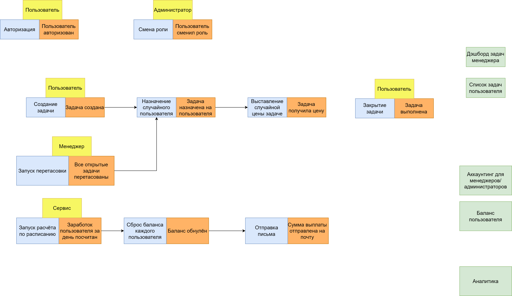

# Архитектура тас трекера для попугов

**Исходники диаграмм по
этой** [ссылке](https://drive.google.com/file/d/1m3sP2oJGHs9ZgsTWfn-XTfSfru0Bgh-5/view?usp=sharing)

## Модель данных и разбитие на домены

Почему-то очень напрягает, что разбивка по контекстам произведена не нами на этапе анализа, а предоставлена
уже готовая в описании проекта. Но выглядит логично, так что придумывать какой-то велосипед не стал.


Accounting достаточно сильно связан с механизмом задач, однако по своей сути не завязан только на задачи.
Задачи тут – исключительно один из возможных ресурсов для расчёта.

Аналитика скорее технически требует выделения, поскольку там 3 пятницы на дню и их изменения могут сильно
ломать остальные бизнес процессы и наоборот.

## Event storming

Не до конца въехал как делать, выписывал только то, что в моём понимании является бизнес событиями

### Справка по цветовым обозначениям


### Схема



## Описания бизнес и CUD событий

Описание оформил в недожс схему, но интуитивно понятно. Основной посыл формата в том, чтобы выдавать **
полную** информацию об объектах (дабы не нужно было синхронно ходить в сервис за ней или не дай бог строить
ещё одну очередь ради этого).

Через `| null` обозначены скорее опциональные поля, нежели, чем те что могут быть `null` по соглашению. Но это
скорее деталь реализации и в данном контексте не существенно

### Бизнес события

```ts
[
//  Пользователь создан
    {
        uuid: str,
        event_name: str,
        service: str,
        payload: {
            user: {
                id: str,
                full_name: str,
                email: str,
                last_updated: timestamp,
                role_id: int
            }
        },
        timestamp: timestamp
    },

//  Пользователь сменил роль
    {
        uuid: str,
        event_name: str,
        service: str,
        payload: {
            user: {
                id: str,
                full_name: str,
                email: str,
                last_updated: timestamp
            },
            old_role: {
                id: int,
                name: str,
                permissions: [str],
            },
            new_role: {
                id: int,
                name: str
            },
        },
        timestamp: int
    },

//  Создана задача
    {
        uuid: str,
        event_name: str,
        service: str,
        payload: {
            task: {
                id: str,
                name: str,
                description: str,
                status: {
                    id: int,
                    name: str
                },
            },

        },
        timestamp: int
    },

//  Задача назначена на пользователя
    {
        uuid: str,
        event_name: str,
        service: str,
        payload: {
            task: {
                id: str,
                name: str,
                description: str,
                status: {
                    id: int,
                    name: str
                },
                assignee: {
                    id: str,
                    full_name: str,
                    email: str,
                    role: {
                        id: int,
                        name: str
                    }
                }, // user
            },

        },
        timestamp: int
    },

//  Задача получила цену
    {
        uuid: str,
        event_name: str,
        service: str,
        payload: {
            task: {
                id: str,
                name: str,
                description: str,
                status: {
                    id: int,
                    name: str
                },
                assignee: {
                    id: str,
                    full_name: str,
                    email: str,
                    role: {
                        id: int,
                        name: str
                    }
                }, // user
                price: float
            },

        },
        timestamp: int
    },

//  Задача выполнена
    {
        uuid: str,
        event_name: str,
        service: str,
        payload: {
            task: {
                id: str,
                name: str,
                description: str,
                status: {
                    id: int,
                    name: str
                },
                assignee: {
                    id: str,
                    full_name: str,
                    email: str,
                    role: {
                        id: int,
                        name: str
                    }
                }, // user
                price: float
            },

        },
        timestamp: int
    },

//  Задачи перетасованы
    {
        uuid: str,
        event_name: str,
        service: str,
        payload: {
            // задачи получат новых исполнителей и новую оценку позже, но для этого есть отдельные события выше
            tasks: [
                {
                    id: str,
                    name: str,
                    description: str,
                    status: {
                        id: int,
                        name: str
                    },
                },
            ],

        },
        timestamp: int
    },

//  Заработок пользователя за день посчитан
    {
        uuid: str,
        event_name: str,
        service: str,
        payload: {
            user: {
                id: str,
                full_name: str,
                email: str,
                role: {
                    id: int,
                    name: str
                }
            },
            balance: {
                summary: float,
                daily: float,
                operations: [
                    {
                        task: {
                            id: str,
                            name: str,
                            description: str,
                            status: {
                                id: int,
                                name: str
                            },
                            assignee: {
                                id: str,
                                full_name: str,
                                email: str,
                                role: {
                                    id: int,
                                    name: str
                                }
                            }, // user
                            price: float
                        },
                    }
                ],
            }

        },
        timestamp: int
    },

// Баланс обнулён
    {
        uuid: str,
        event_name: str,
        service: str,
        payload: {
            user: {
                id: str,
                full_name: str,
                email: str,
                role: {
                    id: int,
                    name: str
                }
            },
            balance: {
                summary: float,
                daily: float,
            }

        },
        timestamp: int
    },

// Сумма выплаты отправлена на почту
    {
        uuid: str,
        event_name: str,
        service: str,
        payload: {
            user: {
                id: str,
                full_name: str,
                email: str,
                role: {
                    id: int,
                    name: str
                }
            },
            balance: {
                daily: float,
            },
            to_email: str,
            sending_status: str // success, failed

        },
        timestamp: int
    },
]
```

### CUD события

```ts
[
//  Новый пользователь создан
    {
        uuid: str,
        event_name: str,
        service: str,
        payload: {
            user: {
                id: str,
                full_name: str,
                email: str,
                last_updated: timestamp,
                role: {
                    id: int,
                    name: str
                }
            }
        },
        timestamp: timestamp
    },

// Профиль пользователя обновлён
    {
        uuid: str,
        event_name: str,
        service: str,
        payload: {
            user: {
                id: str,
                full_name: str | null,
                email: str | null,
                last_updated: timestamp,
                role: {
                    id: int,
                    name: str
                } | null
            }
        },
        timestamp: timestamp
    },

// Задача создана
    {
        uuid: str,
        event_name: str,
        service: str,
        payload: {
            task: {
                id: str,
                name: str,
                description: str,
                status: {
                    id: int,
                    name: str
                }
            },
        },
        timestamp: timestamp
    },

// Описывающие поля задачи обновлены
    {
        uuid: str,
        event_name: str,
        service: str,
        payload: {
            task: {
                id: str,
                name: str,
                description: str,
                status: {
                    id: int,
                    name: str
                }
            },
        },
        timestamp: timestamp
    },

// Статус задачи изменился
    {
        uuid: str,
        event_name: str,
        service: str,
        payload: {
            task: {
                id: str,
                name: str,
                description: str,
                status: {
                    id: int,
                    name: str
                },
            },
        },
        timestamp: timestamp
    },

// Стоимость задачи изменилась
    {
        uuid: str,
        event_name: str,
        service: str,
        payload: {
            task: {
                id: str,
                name: str,
                description: str,
                status: {
                    id: int,
                    name: str
                },
            },
        },
        timestamp: timestamp
    },

// Исполнитель задачи изменился
    {
        uuid: str,
        event_name: str,
        service: str,
        payload: {
            task: {
                id: str,
                name: str,
                description: str,
                status: {
                    id: int,
                    name: str
                },
                assignee: {
                    id: str,
                    full_name: str,
                    email: str,
                    role: {
                        id: int,
                        name: str
                    }
                }, // user
            },
        },
        timestamp: timestamp
    },

// Расчётка за день создана
    {
        uuid: str,
        event_name: str,
        service: str,
        payload: {
            balance: {
                summary: float,
                daily: float,
                operations: [
                    {
                        task: {
                            id: str,
                            name: str,
                            description: str,
                            status: {
                                id: int,
                                name: str
                            },
                            assignee: {
                                id: str,
                                full_name: str,
                                email: str,
                                role: {
                                    id: int,
                                    name: str
                                }
                            }, // user
                            price: float
                        },
                    }
                ],
                date: date
            }
        },
        timestamp: timestamp
    },

// Баланс обновлён
    {
        uuid: str,
        event_name: str,
        service: str,
        payload: {
            balance: {
                summary_old: float,
                daily_old: float,
                summary_new: float,
                daily_new: float,
                date: date
            }
        },
        timestamp: timestamp
    },

// Баланс обнулён
    {
        uuid: str,
        event_name: str,
        service: str,
        payload: {
            balance: {
                summary: float,
                date: date
            }
        },
        timestamp: timestamp
    },


]
```
